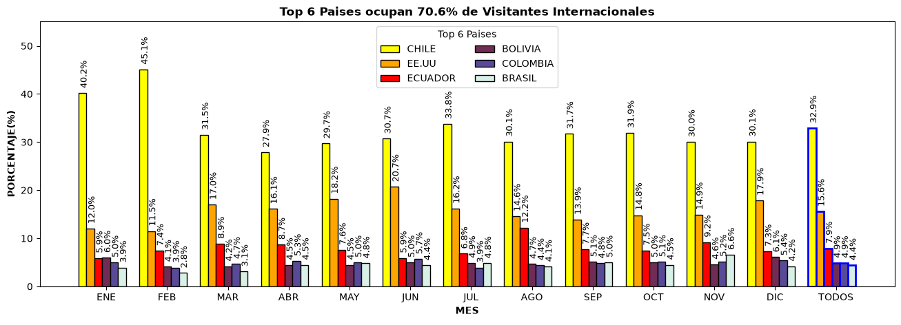
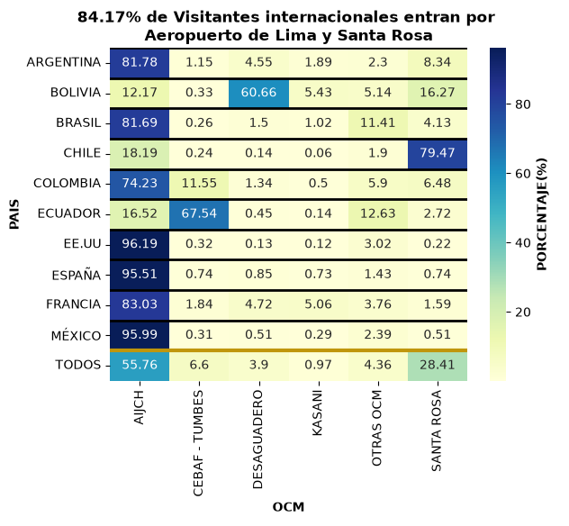
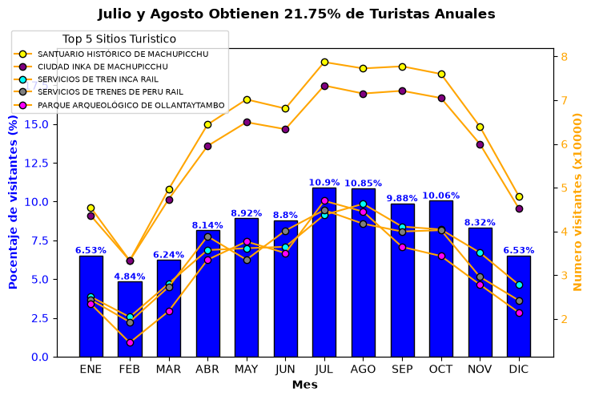
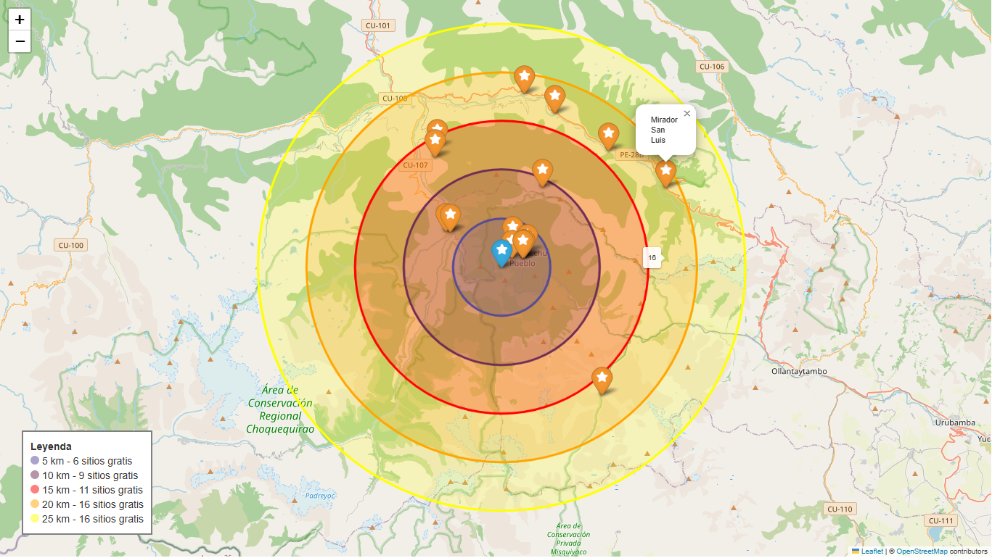
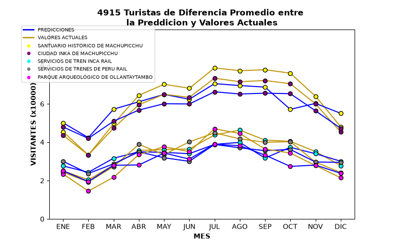

# Tabla de Contenidos
1. [Contexto del Proyecto](#contexto-del-proyecto)
    * [Perspicacias, Recomendaciones y sus Enfoques](#perspicacias-recomendaciones-y-sus-enfoques)
2. [Estructura de los Datos y su Verificaciones](#estructura-de-los-datos-y-su-verificaciones)
3. [Resumen Ejecutivo](#resumen-ejecutivo)
    * [Resumen de Descubrimientos ](#resumen-de-descubrimientos)
    * [Tendencia de los Descubrimientos](#tendencia-de-los-descubrimientos)
4. [Detalles de las Perspicacias](#detalles-de-las-perspicacias)
    * [Concentracion de 56.4% de Visitantes Internacionaless](#concentracion-de-564-de-visitantes-internacionales)
    * [Control Migratorio entre los Top 3 Paises](#control-migratorio-entre-los-top-3-paises)
    * [Los Meses con 21.75% de Turistas Anuales](#los-meses-con-2175-de-turistas-anuales)
    * [16 sitios gratis dentro 25 kms de Machu Picchu](#16-sitios-gratis-dentro-25-kms-de-machu-picchu)
5. [Modelos, Predicciones y sus Impactos](#modelos-predicciones-y-sus-impactos)
    * [Prediciendo los Numero de Turistas Esperados](#prediciendo-los-numero-de-turistas-esperados)
    * [Los 6 tipos de Visitantes Internacionales](#los-6-tipos-de-visitantes-internacionales)
6. [Recomendaciones](#recomendaciones)
    * [Targeted Marketing basado en Pais y OCM de Entrada](#targeted-marketing-basado-en-pais-y-ocm-de-entrada)
    * [Gestionar un Presupuesto Dinamico por cada Mes](#gestionar-un-presupuesto-que-cambie-fluidamente-por-cada-mes)
    * [Incorporar Sitios sin Ingresos en Paquetes Promocionales para Machu Picchu](#incorporar-sitios-sin-ingresos-en-paquetes-promocionales-para-machu-picchu)
7. [KPIs](#kpis)
    * [1. Cambio Porcentual de Clientes](#1-cambio-porcentual-de-clientes)
    * [2. Presupuesto Dinamico](#2-presupuesto-dinamico)
    * [3. Ratio de Sitios](#3-ratio-de-sitios)
8. [Suposiciones y Avisos](#suposiciones-y-avisos)

## Contexto del Proyecto

PeruTur es una compañía pequeña que provee servicios turísticos a visitantes internacionales que ingresan al Perú. Actualmente operan en la ciudad de Lima y quieren expandir hacia todo el país, pero no saben la mejor estrategia para promocionar sus servicios al nivel nacional. Este proyecto utiliza datos públicos peruanos que contienen información sobre los turistas internacionales y sitios turísticos en su entorno durante los años de **2019-2025**.

El análisis y los modelos demuestran que los turistas se pueden agrupar dependiendo de la **Oficina de Control Migratorio (OCM)** de su entrada, con las cuales se puede generar targeted marketing para optimizar las atracciones promocionales. Adicionalmente, se revela que las visitas turísticas tienen una tendencia mensual a través de todo el año, donde la cantidad de turistas es mínima en febrero** y **máxima en julio y agosto. Finalmente, existen una variedad de sitios turísticos sin costo al ingresar, creando una oportunidad para minimizar los costos de sus viajes turísticos. 

Se destacan los enfoques en targeted marketing, presupuesto dinámico y los sitios gratis al crear una estrategia para ayudar a PeruTur a expandirse a un nivel nacional. 

### Informes Internos, Recomendaciones y sus Enfoques
**Concentración de Visitantes y sus Países de Origen**: 95% de los visitantes internacionales provienen de **25 países**, con los top 6 países culminando en 70.6%. Adicionalmente, 5 de estos 6 países son suramericanos. Esto crea una oportunidad para limitar los países para enfocarse y hacer targeted marketing hacia cada uno de estos países. 

**Oficinas de Control Migratorio (OCMs) y los Países Vecinos: 4 de los 81 OCMs nacionales registran el **94.67%** de todos los ingresos internacionales hacia Perú. Adicionalmente, la mayoría de los ingresantes en cada uno de estos 4 OCMs provienen del país vecino más cercano (con la excepción del Aeropuerto Internacional en Lima). Al desarrollar promociones alrededor de estos OCMs, se recomienda enfocar en atraer turistas de los países vecinos más cercanos. 

**Disponibilidad de Sitios Turísticos sin Ingresos**: Machu Picchu, siendo una de las maravillas del mundo, es el sitio turístico más popular en Perú, implicando que la mayoría de los clientes de PeruTur van a tener deseos de viajar ahí. El análisis demostró que existen 16 sitios turísticos **gratis** dentro de un radio de 25 kilómetros de Machu Picchu. Este hecho crea una oportunidad de crear promociones que incluyan esos sitios sin incurrir en costos adicionales (aparte de la gasolina). 

  
El proceso de web scraping y limpieza de datos se encuentra AQUÍ -link

Los análisis de los datos coleccionados se encuentran AQUÍ -link

La creación y evaluación de los modelos se encuentran AQUÍ - link

## Estructura de los Datos y sus Verificaciones
3 conjuntos de datos diferentes se utilizaron para desarrollar los análisis necesarios, y sus componentes son los siguientes:
1. Visitantes internacionales: año, mes, país, continente, OCM y número de visitantes
2. Visitantes en sitios turísticos: año, mes, departamento, sitio turístico y número de visitantes
3. Inventario de recursos turísticos: región, categoría, URL, latitud y longitud

Antes de empezar el análisis, se comprobó la integridad y estructura de los conjuntos a través de organización y limpieza.

## Resumen Ejecutivo
### Resumen de Descubrimientos

La mayoría de visitantes internacionales al Perú se concentran dentro de 25 países, donde Chile, EE. UU. y Ecuador ocupan 56.4% de los visitantes anuales. Esto presenta una oportunidad a PeruTur para que se enfoque en una pequeña cantidad de países y desarrolle targeted marketing. Adicionalmente,  los OCMs de entrada de estos visitantes se parten entre 55.76% y 28.41% para el Aeropuerto de Lima y Santa Rosa, respectivamente. Este hecho sugiere que las ubicaciones de marketing se tienen que enfocar en el entorno de estos OCMs para llegar a la mayoría de sus clientes potenciales. En otro punto, julio y agosto reciben 21.75% de los visitantes anuales, y son los meses donde PeruTur puede invertir más para poder complacer la demanda de servicios turísticos. Finalmente, Machu Picchu es el sitio turístico más popular y tiene en su alrededor otros sitios sin costo al ingresar. PeruTur puede aprovechar esta oportunidad financiera para ampliar sus paquetes promocionales sin tener gastos adicionales (aparte de la gasolina). 

### Tendencia de los Descubrimientos
**Suramérica y Vecinos Peruanos**: 5 de los top 6 países con visitantes internacionales son los vecinos del Perú, y todos los países suramericanos se encuentran dentro de los 25 países con la mayor contribución. 

**Temporadas de Turismo**: En todos los años, julio y agosto tienen la mayor cantidad de visitantes internacionales, mientras febrero tiene la mínima cantidad con solo 4.84* de todos los visitantes anuales. 

**Sitios gratis alrededor de Machu Picchu**: Dentro de un radio de 25 kilómetros de Machu Picchu se encuentran 16 sitios con ingresos gratis, con la mayoría de ellos ubicados a su norte. 

----------------------
## Detalles de los Informes Internos  
### Concentración de 56.4% de Visitantes Internacionales
Reconociendo que el Perú tiene una abundancia de sitios históricos y culturales, incluyendo una de las maravillas del mundo, se esperaba que haya un porcentaje equilibrado de los ingresantes de todos los países. El análisis demostró otras revelaciones.

* **Chile**: tiene 32.9% de **todos** los visitantes internacionales
* **Top 3 Países: ocupan 56.4% de visitantes internacionales
* **Top 6 Países: ocupan 70.6% de visitantes internacionales

Patrones Destacados:
* **Consistencia Mensual**
    - Dentro de cada mes, los top 3 países generalmente son Chile, EE. UU. y Ecuador. Esta consistencia ayudará a crear marketing intencional en todos los meses del año. 
* **Política fronteriza impacta número de visitantes internacionales**
    - 5 de los top 6 países son **vecinos directos** del Perú. Una gran mayoría de visitantes internacionales depende de las políticas al borde de la frontera del Perú. 
* **Gran concentración en 25 de los 198 países**
    - El 95% de todos los visitantes internacionales provienen de los top 25 entre los 198 países. I.e., 177 países no tienen un aporte significativo en los visitantes y no hay necesidad de tener un enfoque importante en ellos. 

   

### Control Migratorio entre los top 3 Paises
Considerando que Chile, EE.UU, y Ecuador ocupan mas de la mitad del total de visitantes, es importante considerara la Oficina de Control Migratorio (OCM) que utilizan para ingresar al Peru.

* El 79.47% de Chilenos entran por el OCM **Santa Rosa** en Tacna, Sur del Peru
* El 96.19% de Estado Unidenses usan el **Aeropuerto Internacional Jorge Chavez**
* El 67.54% de Ecuatorianos ingresan por el OCM **Cebaf-Tumbes** en Tumbes, Norte del Peru

Patrones Destacados:
* 81 OCMs ocupan solo un 4.36% de visitantes internacionales.
    - Existen 86 OCMs en Peru, con 81 de ellas agrupas bajo la misma variable 'OTRAS_OCM'. Solo 4.36% de visitantes internacionales entran por estas otras OCMs, implicando que no tienen un impacto significativo. 
    <h4 id="ocm"></h4>
* OCM y su pais vecino mas **cercano**
    - Cada OCM, excepto el Aeropuerto de Lima, tienen la mayoria de sus ingresantes viniendo del pais vecino mas cercano.
* Santa Rosa y Chilenos
    - Aunque **28.41%** de todos los visitantes internacionales vienen por OCM Santa Rosa, la mayoria de esos ingresantes vienen de Chile. Esto se deduce del hecho que 1/3 de todos los visitantes internacionales son chilenos, y 79.47% de ellos ingresan por Santa Rosa. 

   

### Los Meses con 21.75% de Turistas Anuales
Existen diferentes factores que afectan la cantidad de turistas en un mes, como el clima, eventos historicos, cambios polticos, etc. Algunos de estos factores tienen una temporada anual, impicando que la cantidad de turistas tambien tiene tendencias anuales. 

* Los meses de **Julio y Agosto** obtienen 21.75% de los turistas anuales.
* El mes de Febrero tiene la **menor** cantidad de turistas.
* **Machu Picchu**, incluyendo su ciudad, es el sitio mas visitado en todos los meses.

Patrones destacados:
* Tendencia estacional en todos los sitios turisticos
    - Existe una tendencia estacional en todos los sitios turisticos. En todos los sitios turisticos, Julio y Agosto reciben la mayor cantidad de turistas mientras Febrero tienen la menor cantidad. 
* Prominencia de Machu Picchu
    - Los top 5 sitios tienen algun enfoque con Machu Picchu. Algunos son servicios con destino a Machu Picchu, y otros son sitios en su alrededor. 

   

### 16 sitios gratis dentro 25 kms de Machu Picchu
Se esperaba que Machu Picchu, siendo una de las maravillas del mundo, es el sitio turistico mas popular. Tambien se encuentran una variedad de sitios turisticos cercanos con cero costo de ingreso, proveyendo una oportunidad que maximiza ganacias a una agencia turistica. 

* Existen 16 sitios **sin costo al ingresar** dentro 25 kilometeros de Machu Picchu.
* La mayoria de estos sitios se encuentran hacia el **Norte** y en rutas principales. 

## Modelos, Predicciones y sus Impactos
### Prediciendo los Numero de Turistas Esperados
Prediciendo la cantidad de visitantes que espera dentro de un mes ayudaria en la optimizacion de recursos para un negocio. Dado el mes, departamento, y nombre del sitio turistico, el modelo de regresion predeci los numero de visitantes esperados en ese sitio turistico. 

Tres modelos candidatos se utilizaron con estos datos: Regresion lineal, regresion lasso, random forest. Con una metrica adecuada aplicada a todos los candidatos, el modelo bosque aleatorio (random forrest) obtuvo los mejores resultados. 

Al aplicar el modelo con los datos disponibles, se calcula que hay una pequena diferencia promedia de 4,915 turistas entre la prediccion y el valor actual. Los resultados demuestran que el modelo se puede utilizar con confianza para prediccir la cantidad de turistas dentro una temporada mensual.

   

### Los 6 tipos de Visitantes Internacionales
KMeans es un algoritmo que agrupa puntos de datos en clusters, depediendo en su cercania entre uno al otro. Este proceso revelo los siguientes clusteres:

* Cluster 1: Los ingresantes por OCM Santa Rosa
* Cluster 2: Los visitantes Chilenos y Estadounidenses 
* Cluster 3: Los ingresantes por OCMs Aeropuerto internacional de Lima y Cebaf-Tumbres
* Cluster 4: Los ingresantes por otros OCMs no considerados
* Cluster 5: Los ingresantes por OCM Desaguadero
* Cluster 6: Los ingresantes por OCM Kasani

KMeans pricipalmente agrupo los visitantes internacionales por su OCM de entrada. Considerando que mayoria de visitantes de un OCM son ciudadanos del <a href="#ocm">pais mas cercano</a>, esta separacion es coherente con los datos. 

El segundo cluster se enfoca completamente en el pais de origen de los visitantes, especialmente de Chile y EE.UU. Reconociendo que estos dos paises forman [48.5% de todos los visitantes internacionales](#concentracion-de-564-de-visitantes-internacionales), se determina que este cluster es coherente con los datos. 

En practica, se puede desarrollar un targeted marketing a cada uno de los clusteres. Al llegar un nuevo vistante, se le puede asignar un cluster al notar de que OCM ingreso. Al unirse con un cluster, se le puede mostrar las mismas promociones de marketing que a otras personas del mismo grupo.

## Recomendaciones
Considerando las perspicacias y resultados de los modelos, se recomienda al **equipo de Marketing** de PeruTur los siguiente puntos:

### Targeted Marketing basado en Pais y OCM de Entrada
Los top 10 paises con visitantes internacionales ocupan 82.5% de **todos** los visitantes internacionales, con Chile obteniendo casi 1/3 de toda esa poblacion y 6 de los 10 paises siendo de Suramerica. Adicionalmente, se descubrio que a mayoria de ingresantes en cada OCM son del **vecino pais mas cercano**, creando un enlace entre punto de entrada y pais de origin. Este hecho fue fortalecido por los clusteres creados por el algoritmo KMeans, agrupando a todos los visitantes por el OCM de entrada. 

Por ende, se recomienda que el equipo de Marketing se enfoque en los siguiente targeted marketing:
* OCM Aeropuerto de Lima: Enfoque a un nivel internacional, sin enfocarse tanto en paises surmaericanos.
* OCM Santa Rosa: Enfoque en Chile.
* OCM Cebaf-Tumbes: Enfoque en Ecuador.
* OCM Desaguadero: Enfoque en Bolivia.
* Todos los otros OCMs: inversion minima y general. 

   

### Gestionar un Presupuesto que cambie Fluidamente por cada Mes
Los sitios turisticos tienen sus temporadas altas, en Julio y Agosto, y bajas, en Febrero. Para optimizar el uso de un presupuesto anual, se recomienda crear un **presupuesto dinamico** que asigne un valor alto durante Julio y Agosto mientras Febrero recibe un valor bajo. 

Esta dinamica tambien afectaria a las campanas que se desarollan, pero las tendencias de los paises origines es consistente en todos los meses. Considerando que la mayoria de visitantes internacionales tiene origines en Chile en todos los meses, seria mejor enfocarse en marketing hacia los Chilenos durante temporada baja. De lo contrario, durante temporada alta, y con mas mas presupuesto, se puede expander las campanas hacia Estado Unidenses, Ecuatorianos, y otros, dependiendo en la suma de presupuesto. 

   

### Incorporar Sitios sin Ingresos en Paquetes Promocionales para Machu Picchu
Machu Picchu, siendo una de las maravillas del mundo, es el sitio turistico mas popular en Peru. Lo que tambien se decubrio es que existen una variedad de otros sitios en su alrededor sin costo para ingresar. Dentro de 25 kilometros de Machu Picchu se encuentran 16 de estos sitios **gratis**. Con la inversion de gasolina, para llevar a turistas dentro 25 kilometros, este hecho se puede incorporar con paquetes promocionales para generar mas atraccion. 

## KPIs

### 1. Cambio porcentual de Clientes
(Clientes Nuevos - Clientes Viejos)/Clientes Viejos x 100

Enfoque: Para medir la eficacia de las campanas de targeted marketing, se medira esta metrica en cada OCM que obtengo una promocion de marketing.  

   

### 2. Presupuesto Dinamico
Presupuesto Anual x (Turistas Mensual / Turistas Anual)

Objetivo: Asignar un presupuesto proporcional al porcentaje de turistas que se manifestan mensualmente.

   

### 3. Ratio de Sitios
Sitios gratis : Sitios no-gratis

Enfoque: este ratio mostrara el efecto al incorporar sitio gratis en promociones, con el objetivo de aumentar el valor. 

## Suposiciones y Avisos
Este analisis desarrollo las siguientes asunciones para poder superar multiple desafios:
* Turistas vs Excursionistas: Considerando los datos limitados, no se diferencio entre un turista y excursionista en estos datos. Por igual, es posible que un excursionista visite un sitio turistico o que un turista no visite ningun sitio. Ambas categorias se consideraron bajo "visitantes internacionales"
* Clima: Aunque el clima es un factor importante en el movimiento turistico, se omitieron estos datos por la gran diferencia entre la costa, sierra, y selva del Peru. Este punto se le informo a la empresa y ellos decidieron empezar registrar climas en todos los sitios turisticos. En un proyecto futuro se pudiera integrar esta informacion para mejorar la predicciones del modelo de regresion. 

